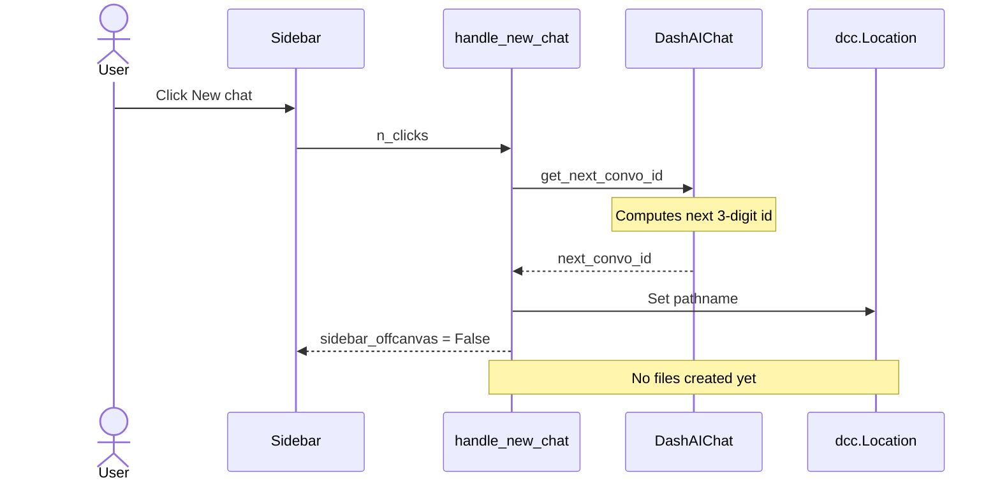
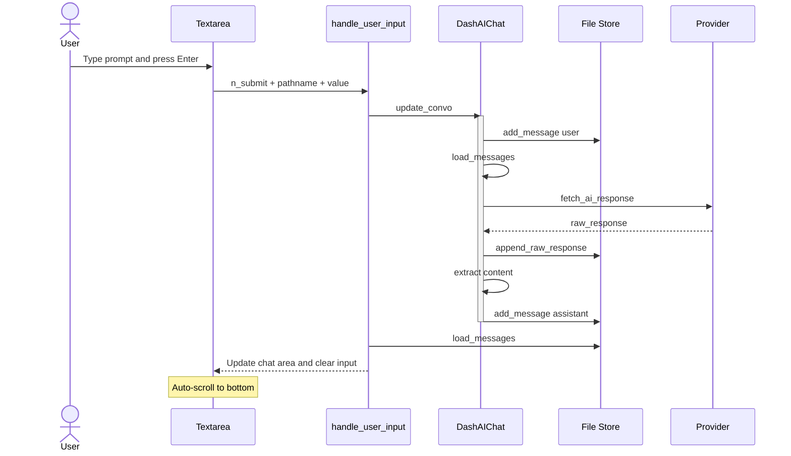
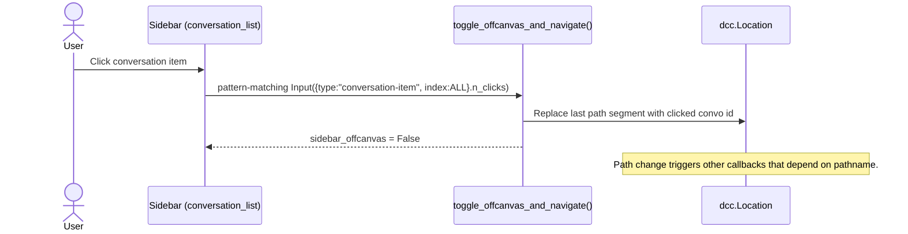
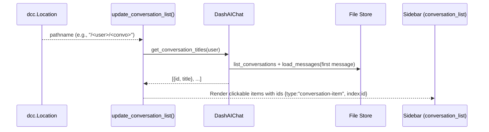

# Dash AI Chat

[](https://pypi.org/project/dash-ai-chat/)
[](https://www.python.org/downloads/)
[](https://opensource.org/licenses/MIT)
[](https://deepwiki.com/eliasdabbas/dash-ai-chat)

> Stop building chat UIs from scratch every time. Get a fully-functional AI chat interface with 3 lines of code, then infinitely customize and extend without starting over every time.

_This package is fully functional and ready for testing and simple implementations, but not yet for production environments. If you have any suggestions for improvements please submit an issue._

## ✨ Key Features

- **🚀 Quick Setup**: Get a chat app running in 3 lines of code
- **🎨 Highly Customizable**: Override any component to match your design and functionality
- **🔌 Multi-Provider Support**: OpenAI, Anthropic, Google Gemini, or any other provider
- **💾 Persistent Storage**: Chat history saved automatically
- **📱 Responsive Design**: Works beautifully on desktop and mobile
- **🎯 Production Ready**: Built on proven Plotly Dash framework

## Quick Start

### Installation

```bash
pip install dash-ai-chat[openai]
```

### Basic Usage

```python
from dash_ai_chat import DashAIChat

# Set your OPENAI_API_KEY environment variable
app = DashAIChat(base_dir="./chat_data")

if __name__ == "__main__":
    app.run(debug=True)
```

That's it! Visit `http://localhost:8050` to start chatting.

## Examples are worth a thousand words!

Explore the comprehensive examples to see what's possible:

- **[00_minimal_chat.py](examples/00_minimal_chat.py)** - The absolute quickest way to get a fully-functional AI chat system running with just 3 lines of code
- **[01_python_assistant.py](examples/01_python_assistant.py)** - Create specialized AI assistants with custom system prompts, demonstrating how to build a Python programming helper named PyHero
- **[02_disclaimer_chat.py](examples/02_disclaimer_chat.py)** - Add custom UI elements like disclaimers and warnings to your chat interface without breaking existing functionality
- **[03_gemini_provider.py](examples/03_gemini_provider.py)** - Switch to Google's Gemini AI with just two configuration parameters, showing how easy provider switching can be
- **[04_signature_chat.py](examples/04_signature_chat.py)** - Extract token usage from API responses and add professional signatures to assistant messages with custom styling
- **[05_anthropic_model_selector.py](examples/05_anthropic_model_selector.py)** - Configure Anthropic Claude models with runtime switching capabilities and interactive model selection dropdowns
- **[06_runtime_provider_switching.py](examples/06_runtime_provider_switching.py)** - Dynamically switch between OpenAI, Anthropic, and Gemini providers **and their models** mid-conversation with simple attribute assignments
- **[07_interactive_components.py](examples/07_interactive_components.py)** - Embed interactive Dash components like dropdowns and buttons directly into AI responses for enhanced user engagement
- **[08_corporate_dashboard.py](examples/08_corporate_dashboard.py)** - Complete enterprise-grade dashboard showcasing the extreme customization possibilities with corporate branding, navigation, and multi-panel layouts
- **[09_zen_minimal.py](examples/09_zen_minimal.py)** - Minimalist design aesthetic demonstrating creative UI possibilities with floating elements, split-screen views, and zen-like simplicity
- **[10_generate_speech.py](examples/10_generate_speech.py)** - Text-to-speech integration allowing AI responses to be converted to audio with customizable voice options
- **[11_generate_speech_advanced.py](examples/11_generate_speech_advanced.py)** - Advanced speech generation with voice selection controls and audio playback management features

### Running Examples

```bash
git clone https://github.com/eliasdabbas/dash-ai-chat.git
cd dash-ai-chat

# Create and activate virtual environment
python3 -m venv venv
source venv/bin/activate  # On Windows: venv\Scripts\activate

# Install with all providers
pip install -e .[openai,anthropic,gemini]

# Try any example
python examples/00_minimal_chat.py
```

## Provider Support

Install optional dependencies for different AI providers:

```bash
# OpenAI (GPT models)
pip install dash-ai-chat[openai]

# Anthropic (Claude models)
pip install dash-ai-chat[anthropic]

# Google Gemini
pip install dash-ai-chat[gemini]

# All providers
pip install dash-ai-chat[openai,anthropic,gemini]
```

## What is it?

The `dash-ai-chat` library is a Dash app distributed as a Python package.

It contains basic UI elements and data persistence logic, and designed to be entirely customizable.

The default implementation contains only the essential elements with basic defaults, and pretty much everything is designed to be customized and changed.

Additional interactivity can easily be introduced using standard Dash callbacks. If you know Dash, it should be easy to pick up.

## Core API

### Basic Configuration

```python
from dash_ai_chat import DashAIChat

app = DashAIChat(                                 # A Dash sub-class
    base_dir="./chat_data",                       # Chat storage directory
    provider_spec="openai:chat.completions",      # AI provider specification
    provider_model="gpt-4o",                      # Default model
    **kwargs                                      # Additional Dash app parameters
)
```

## Customization

General workflow:

1. Create a class (sub-class of `DashAIChat`):

```python
from dash_ai_chat import DashAIChat

class MyCustomAIChat(DashAIChat):
    def default_method(self, ...):
        default_data = super().default_method()
        # add custom logic to default_data
```

2. Create an `app` instance, just you like you do with Dash:

```python
app = MyCustomAIChat(base_dir="my_base_dir")

if __name__ == "__main__":
    app.run(debug=True)
```

#### In more detail:

### Custom System Messages

```python
class MyAssistant(DashAIChat):
    # override the default load_messages method:
    def load_messages(self, user_id: str, conversation_id: str):
        # default_data:
        messages = super().load_messages(user_id, conversation_id)
        # futher logic to customize what to do with loaded messages
        if not messages:
            messages = [{
                "role": "system",
                "content": "You are a helpful Python programming assistant."
            }]

        return messages
```

### UI Customization

Override any component to customize the interface:

```python
from dash import html

class CustomChat(DashAIChat):
    def header(self):
        default_header = super().header()
        return html.Div([
            html.H1("My Custom Chat", className="text-center"),
            html.Hr(),
            default_header
        ])

    def input_area(self):
        # Add custom elements to input area
        original = super().input_area()
        disclaimer = html.Div("AI responses may contain errors")
        return html.Div([original, disclaimer])
```

## Architecture

Dash AI Chat uses a clean, extensible architecture:

- **DashAIChat**: Main application class with overridable methods
- **Provider System**: Pluggable AI provider backends
- **Message Storage**: JSON-based persistent chat history
- **Component System**: Override any UI component

## Advanced Usage

### Custom Providers

```python
class MyCustomProvider:
    def client_factory(self):
        # Create your AI client
        return YourAIClient(api_key="your-key")

    def call(self, client, messages, model, **kwargs):
        # Call your AI API
        return client.chat(messages=messages, model=model, **kwargs)

    def extract(self, response):
        # Extract text from API response
        return response.choices[0].message.content

    def format_messages(self, messages):
        # Format messages for your API
        return messages

# Register and use your provider
app = DashAIChat(base_dir="./chat_data")
app.AI_REGISTRY["custom:provider"] = MyCustomProvider()
app.provider_spec = "custom:provider"
```

---

# `dash-ai-chat` • Core Lifecycles

Conventions used below:

* **UI** = rendered Dash components
* **CB** = server callback
* **Engine** = `DashAIChat` engine methods
* **Store** = on-disk JSON/JSONL under `BASE_DIR/chat_data/<user_id>/<convo_id>/`
* **URL** = `dcc.Location(pathname)`

---

## 1) New Chat button → route creation (no I/O yet)



---

## 2) Send message (Enter) → persist + call provider + render



---

## 3) Click conversation in sidebar → navigate & close sidebar



---

## 4) Route change → refresh conversation list (titles)



---

### Notes & edge cases

* If pathname has no `<convo_id>`, `handle_user_input`/`handle_new_chat` compute `get_next_convo_id` on the fly.
* `update_convo` is the only place that guarantees directories/files exist (via `_ensure_convo_dir`).
* Files written per conversation:

  * `messages.json` (full history)
  * `raw_api_responses.jsonl` (raw provider responses)
  * `metadata.json` (optional)
* Client-side helpers:

  * Auto-scroll chat area after message render
  * RTL/LTR detection toggles textarea direction


### Storage layout:

```text
BASE_DIR/
  chat_data/
    <user_id>/
      001/
        messages.json
        raw_api_responses.jsonl
        metadata.json
      002/
        ...
```

**Ready to build amazing AI chat interfaces?** Start with the [examples](examples/) and customize to your heart's content! 🚀