# `DashAIChat` Examples

This directory contains comprehensive examples showcasing the flexibility and customization capabilities of `DashAIChat`. Each example demonstrates different aspects of the framework, from basic setup to advanced functionality and layout customizations.

## 🚀 Getting Started

First, install `dash-ai-chat` with the providers you want to use:

```bash
# Install with selected providers
pip install dash-ai-chat[openai,anthropic,gemini]

# Or install specific providers
pip install dash-ai-chat[openai]  # Just OpenAI
```

Set your API keys as environment variables:

```bash
export OPENAI_API_KEY="your-openai-key"
export ANTHROPIC_API_KEY="your-anthropic-key"  
export GOOGLE_API_KEY="your-google-key"
```

Run any example:

```bash
python examples/00_minimal_chat.py
```

## Examples Overview

### Basic Examples

#### [00_minimal_chat.py](00_minimal_chat.py)
**The absolute quickest way to get started - See what you get out of the box!**

Just 3 lines of code gives you a complete AI chat interface:

```python
from dash_ai_chat import DashAIChat
app = DashAIChat(base_dir="./chat_data")
app.run(debug=True, port=8050)
```

**What you get immediately:**

| **Clean, responsive chat interface** | **Automatic conversation management** |
|---|---|
| 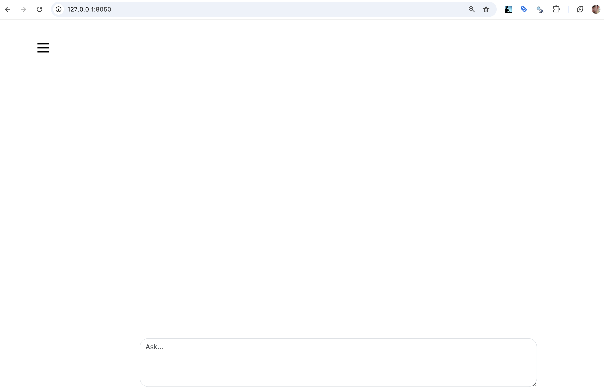 | 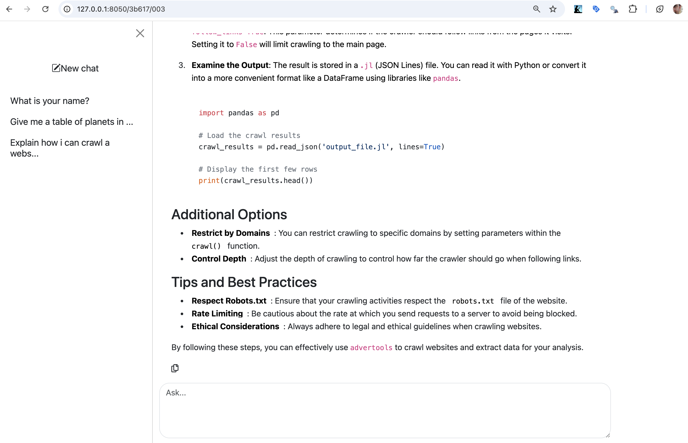 |
| Clean, familiar UI<br/>Responsive design that works on all screen sizes<br>Burger menu to display/hide chat history | Sidebar with conversation history<br/>Auto-generated conversation titles<br/>Easy switching between conversations<br/>New chat button to start fresh |

| **Persistent file-based storage** | **JSON message format** |
|---|---|
| 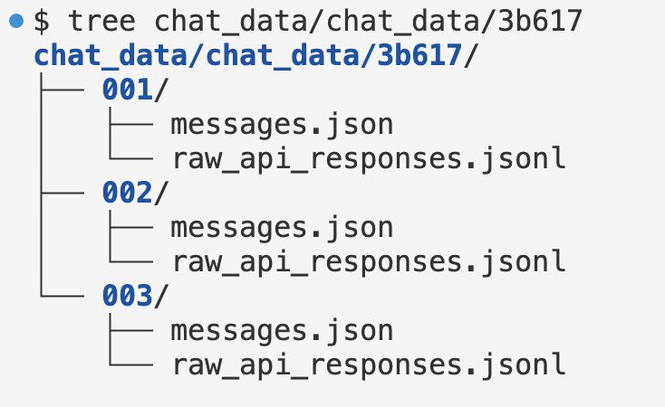 |  |
| Clean folder structure organized by user<br/>Each conversation gets its own directory<br/>No database required - pure JSON files | Standard OpenAI message format<br/>Easy to read, debug, and process<br/>Each message with role and content |

| **Built-in copy functionality** | **Raw API response logging** |
|---|---|
| 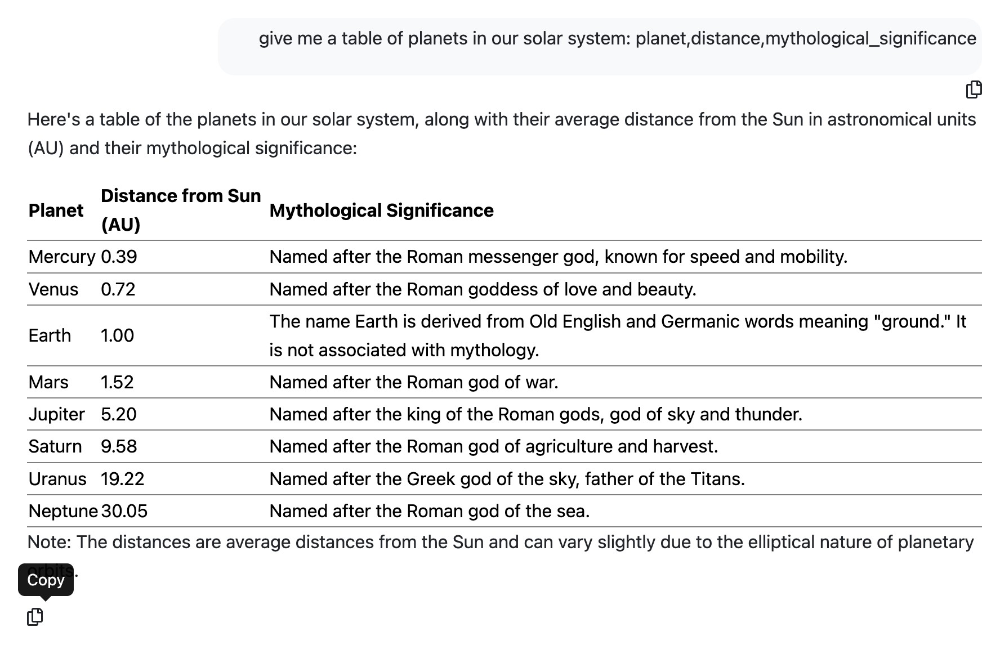 | 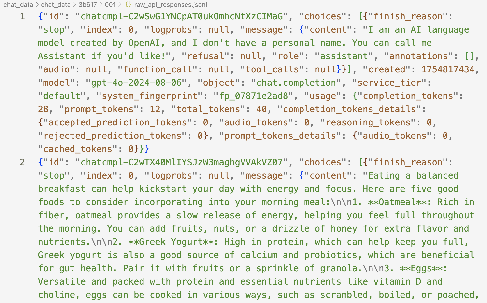 |
| Copy button on every message<br/>Messages copied in clean markdown format<br/>Perfect for sharing or documentation | Complete raw API responses saved as JSONL<br/>Perfect for debugging and analytics<br/>Perfect for customizing functionality<br>Token usage, model info, and full response data |

**Key takeaways from the minimal example:**
- **Zero configuration** - just set `OPENAI_API_KEY` and run
- **Production patterns** - proper message storage, conversation management
- **Developer-friendly** - easy to inspect data, debug, and extend
- **URL structure** - clean `/user_id/conversation_id` routing
- **Foundation for customization** - every element can be overridden

#### [01_python_assistant.py](01_python_assistant.py)
**Custom system messages and behavior - Create specialized AI assistants**

| **Custom system message takes effect** | **Assistant stays in character** |
|---|---|
|  |  |
| AI introduces itself as PyHero with Python focus<br/>System message successfully shapes AI personality<br/>Professional, helpful tone established from first interaction | Assistant politely redirects non-Python questions<br/>Stays true to its specialized role<br/>Demonstrates how system prompts control behavior |

#### [02_disclaimer_chat.py](02_disclaimer_chat.py)
**Adding custom UI elements - Extend the interface without breaking functionality**


Shows how to add custom UI elements like disclaimers and warnings while preserving all existing functionality. Perfect for adding any UI elements (navigation, branding, titles, etc.)

### Provider Examples

#### [03_gemini_provider.py](03_gemini_provider.py)
**Google Gemini integration**
- Switch to Google's Gemini AI with just 2 parameters
- Demonstrates provider switching
- Uses Gemini 2.5 Flash model

#### [05_anthropic_model_selector.py](05_anthropic_model_selector.py)
**Anthropic Claude with dynamic model selection - Interactive model switching**

| **Model selector dropdown** | **Live model switching** |
|---|---|
|  |  |
| Interactive dropdown to choose between Claude models<br/>Clean UI integration with existing interface<br/>Real-time model switching capability | Models switch instantly within same conversation<br/>Different Claude variants for different needs<br/>Seamless provider configuration management |

#### [06_runtime_provider_switching.py](06_runtime_provider_switching.py)
**Dynamic provider/model switching during conversations - Compare AI providers in real-time**

| **Provider selector** | **Model selector** |
|---|---|
|  |  |
| Switch between OpenAI, Anthropic, and Gemini providers<br/>Mid-conversation provider changes<br/>Perfect for comparing AI responses and capabilities | Additional model selection within each provider<br/>Fine-grained control over AI behavior<br/>Advanced provider management and configuration |

### Customization Examples

#### [04_signature_chat.py](04_signature_chat.py)
**Professional message styling with token usage - Custom signatures and analytics**


Demonstrates professional message styling with custom signatures, token usage display, and enhanced formatting. Perfect for business applications requiring detailed analytics and professional presentation.

This is just one way of utilizing the `raw_api_responses.jsonl` file available in every conversation folder.

#### [07_interactive_components.py](07_interactive_components.py)
**Adding interactive Dash components - Make AI responses truly interactive**

| **Interactive dropdown in AI response** | **Custom prompt from selection** |
|---|---|
| 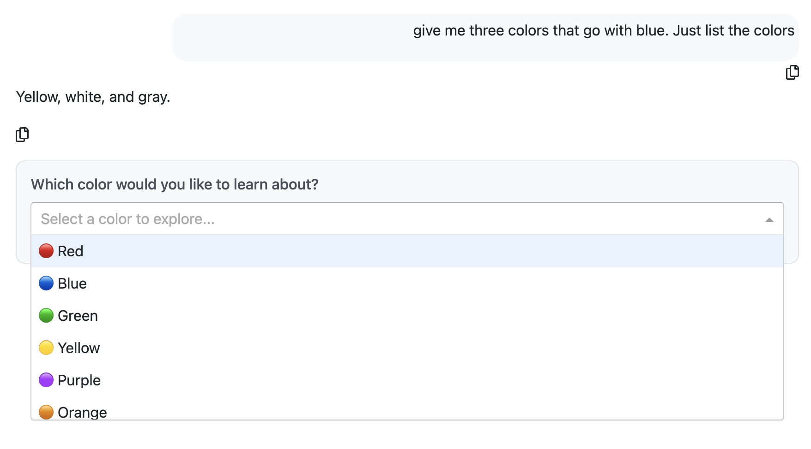 | 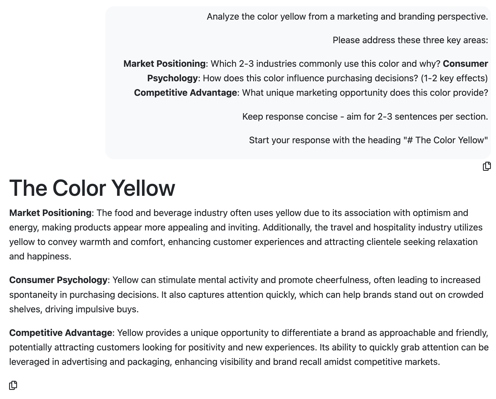 |
| Dropdown component embedded directly in assistant message<br/>Interactive widgets as part of AI responses<br/>Seamless integration with Dash component ecosystem | User selection creates custom follow-up prompt<br/>Interactive responses trigger new conversations<br/>Dynamic user engagement and enhanced functionality |

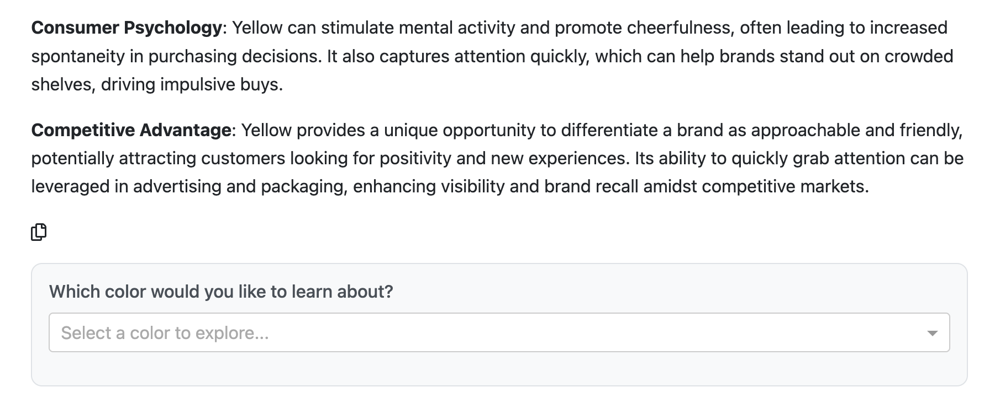
*Additional interactive components can be appended to enhance user engagement*

#### [08_corporate_dashboard.py](08_corporate_dashboard.py)
**Full enterprise dashboard layout - Complete customization showcase**

You'll need to build the additional functionality though!

| **Completely custom UI design** | **Custom sidebar and navigation** |
|---|---|
| 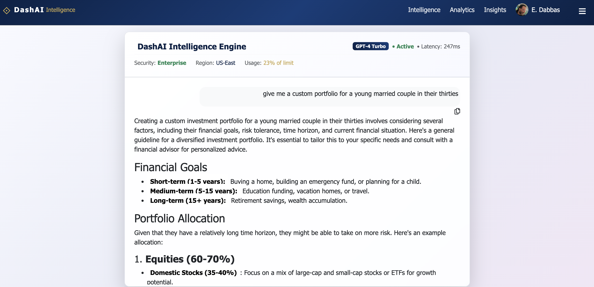 | 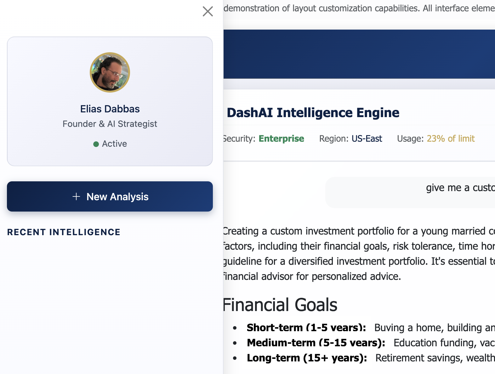 |
| Complete visual redesign showing unlimited customization potential<br/>Professional enterprise-grade interface<br/>Corporate branding and multi-panel layout | Custom navigation and user management<br/>Professional sidebar with additional functionality<br/>Integration of business logic and workflows |

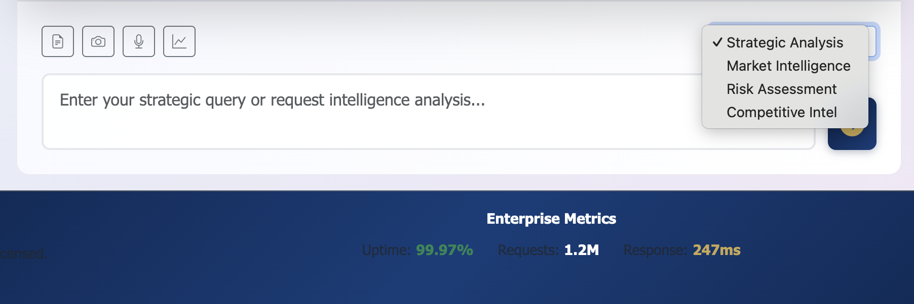
*Demonstrates how to build custom functionality and integrate business requirements*

#### [09_zen_minimal.py](09_zen_minimal.py)
**Minimalist design aesthetic - Clean, zen-like interface design**

In case bells and whistles are not your thing.

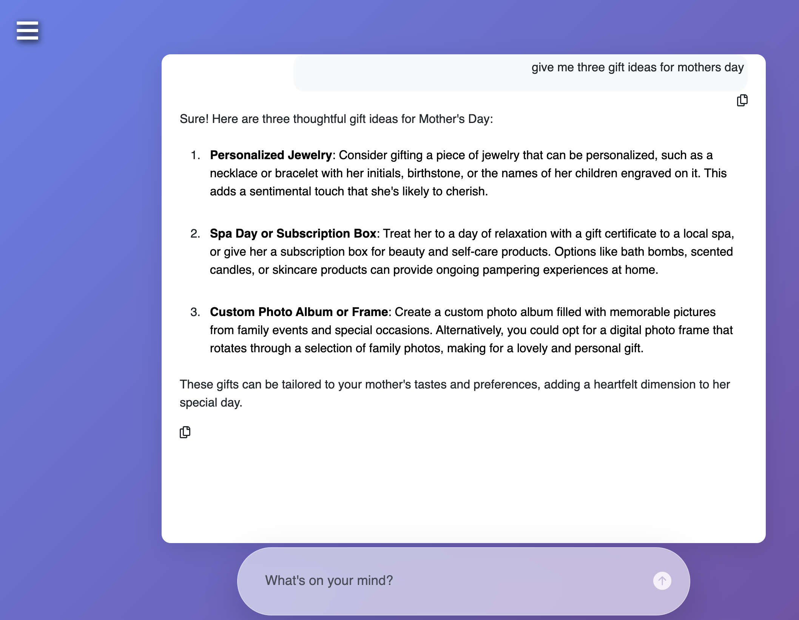

Demonstrates creative UI possibilities with floating elements, custom styling, and zen-like simplicity. Shows how completely the interface can be transformed while maintaining all core functionality.

### Advanced AI Capabilities

#### [10_generate_speech.py](10_generate_speech.py)
**Text-to-Speech integration - Convert text to natural speech**

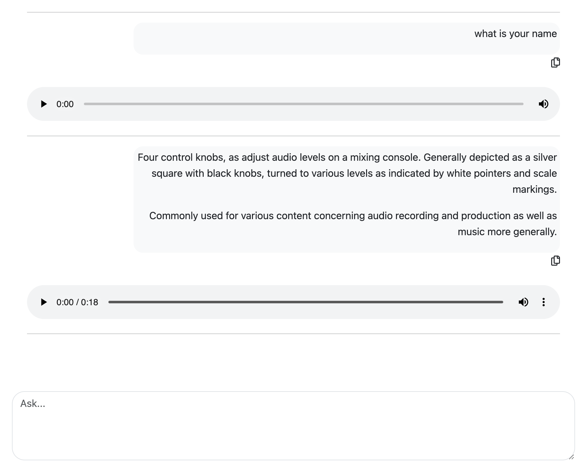

Simple text-to-speech integration showing how to extend DashAIChat beyond text-only interactions. Demonstrates the provider pattern for adding new AI capabilities like speech generation, with automatic audio file management and playback.

#### [11_generate_speech_advanced.py](11_generate_speech_advanced.py)
**Advanced Text-to-Speech with full controls - Professional speech generation with custom UI**


Complete text-to-speech application showcasing DashAIChat's flexibility and power. Features sophisticated UI controls for model selection, voice customization, speed adjustment, format selection, and advanced instructions. Perfect example of clean subclassing patterns and custom provider integration with minimal code.

### Customization Patterns

1. **Override methods** - Extend `DashAIChat` and override specific methods
2. **Provider switching** - Use `provider_spec` and `provider_model` parameters  
3. **Layout modification** - Override UI methods like `header()`, `input_area()`, etc.
4. **Message customization** - Override `load_messages()` and `format_messages()`

### Common Customizations

```python
class MyCustomChat(DashAIChat):
    def header(self):
        # Custom header
        default_header = super().header()
        return [html.H1("My AI Assistant"), default_header]

    def load_messages(self, user_id, conversation_id):
        # Custom system message
        messages = super().load_messages(user_id, conversation_id)
        if not messages:
            messages = [{"role": "system", "content": "You are a helpful assistant."}]
        return messages
```

**Happy building!** 🎉